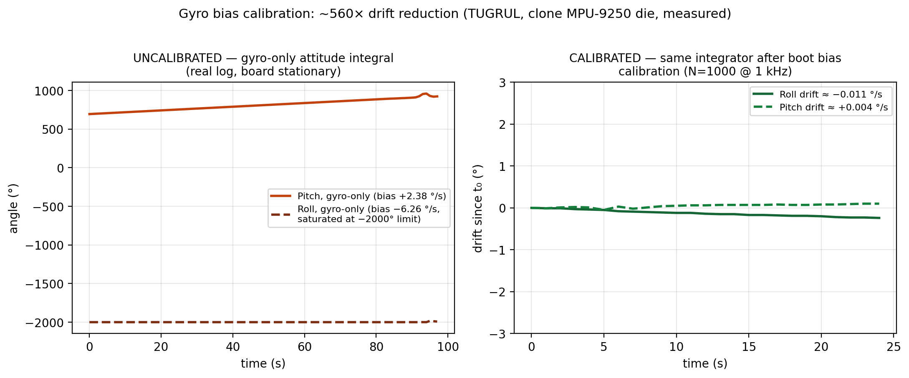
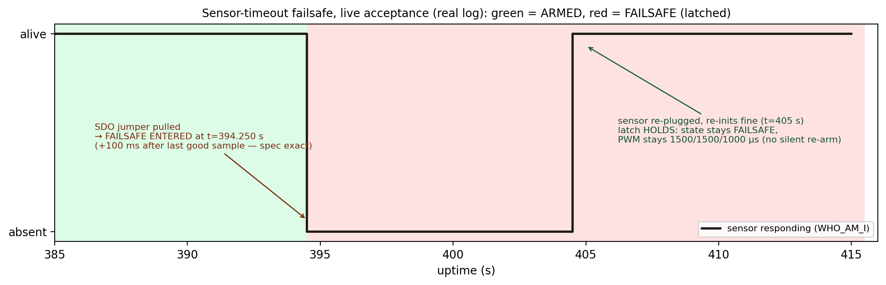

# TUGRUL — Bare-Metal Flight Controller Firmware (STM32F446RE)

Register-level flight control firmware for a fixed-wing UAV, written from scratch on an
STM32 Nucleo-F446RE — **no HAL, no RTOS, no vendor libraries** (CMSIS device header for
register layout only). Every peripheral (clock tree, UART, SPI, timers/PWM, watchdog) is
brought up by explicit, documented register writes.

The point of this project is not the feature list — it is the **evidence discipline**:
every claim below is backed by a real measurement, and the raw acceptance logs are in
[`evidence/logs/`](evidence/logs/). Claims that have not been measured yet are labelled
as pending, not implied.



## Measured results (bench, real hardware)

| Claim | Measurement | Evidence |
|---|---|---|
| 84 MHz PLL off HSE bypass, 2 flash wait states | Boot banner + read-back sequencing; panic path never triggered | boot logs |
| Attitude (complementary filter, integer-only) | Static noise roll ±0.03°, pitch ±0.07°; inverted mount reported correctly (≈ −178.9°); 90° test −89.5° ± 0.2° (hand-held) | `evidence/logs/` |
| Gyro bias boot calibration (N=1000 @ 1 kHz) | Bias −820/312/63 LSB (= −6.26 °/s worst axis); gyro-only drift −6.2 °/s → **≈ −0.011 °/s (~560×)**; repeatable ±4 LSB over 4 boots | `gyrocal_2026-07-03.log`, chart above |
| Sensor-timeout failsafe (100 ms, latched) | Trip **exactly +100 ms** after last good sample (t=394.250 s); PWM forced to 1500/1500/1000 µs; sensor re-plug re-inits fine but **latch holds** — no silent re-arm | `failsafe_2026-07-03.log`, timeline below |
| IWDG watchdog (nominal 500 ms) | 3 full hang→reset cycles observed live; reset cause read from RCC_CSR and logged; normal image runs 25+ s uninterrupted | `iwdg-*_2026-07-03.log` |
| Build | 9492 B text, zero warnings, arm-none-eabi-gcc | reproducible via `make` |



## Architecture

```
main loop (1 kHz control tick, SysTick time base)
 ├─ SPI1 driver         two-speed policy: config ≤1 MHz, data burst 10.5 MHz
 ├─ MPU-9250 driver     wake/reset sequence with read-back verification, hot-plug state machine
 ├─ gyrocal             boot bias calibration, integer math, host-mirror verified (Python)
 ├─ attitude            complementary filter, fixed-point integer only (no float anywhere)
 ├─ PWM (TIM3, 50 Hz)   aileron/elevator/throttle, safe defaults from power-on
 ├─ failsafe            IMU freshness watchdog: 100 ms timeout → latched safe outputs
 └─ IWDG                independent hardware watchdog, deliberate-hang test hook (build-gated)
```

Design decisions worth defending (full rationale in commit history and `docs/`):

- **Integer-only numerics.** The FPU exists, but a fixed-point path is bit-for-bit
  deterministic and trivially host-verifiable — `src/gyrocal_check.py` mirrors the
  firmware math on the PC and must agree exactly (6/6 test vectors).
- **Failsafe latches; a watchdog reset is the only legitimate re-arm.** IMU loss
  invalidates attitude state; auto-resuming on sensor return without revalidation is
  not defensible. The live log proves the latch survives a sensor come-back.
- **"Guards loss, not absence."** The failsafe arms on the first successful IMU sample,
  not at boot — otherwise a 100 ms timeout structurally collides with a ~1 s sensor
  bring-up. Found the hard way (every boot latched), diagnosed on-target with GDB.
- **Every fault path reports honestly.** A missing sensor logs `no response`, a dead bus
  is distinguished from a wrong ID, and the boot banner never lies about clock state
  (on clock failure the firmware stays silent on UART and blinks a panic pattern
  rather than printing at a wrong baud).

## The clone sensor story

The MPU-9250 breakout answered `WHO_AM_I = 0x75` — not a valid family ID, and
suspiciously also the *address* of the WHO_AM_I register (a bus that echoes the address
byte would produce the same value). The firmware accepts it only behind a discriminator:
`PWR_MGMT_1` must read its documented reset value (0x01), which an address-echoing bus
cannot satisfy; the log then reports `OK (clone die)` — never a bare OK. All sensitivity
constants are nominal datasheet values, so absolute scale on this clone is treated as
approximate (gravity magnitude measured 991–1032 mg, ~3% tolerance).

## Build & flash

Prerequisites: `arm-none-eabi-gcc`, `make`, OpenOCD (xPack ≥0.12, `transport swd`),
ST-LINK with WinUSB driver on Windows (Zadig).

```
make            # build (zero warnings expected)
make flash      # program + verify + reset via OpenOCD/SWD
make debug      # OpenOCD + GDB, break at main
make TEST_HANG=1   # deliberate IWDG hang image — NEVER ship; run `make clean` after
```

Serial console: 115200 8N1 on the ST-LINK VCP. Wiring for the IMU: `docs/wiring-mpu9250.md`.

## Known limitations (deliberate honesty)

- **Bench project by design.** No flight testing — out of scope. This is measured
  flight-control *firmware*, not a flying aircraft.
- **No oscilloscope evidence yet:** PWM waveform and control-loop jitter are asserted
  from code and logs only; scope captures are the next evidence layer.
- **Attitude accuracy is pre-evidence:** static/90° numbers above were taken without a
  jig (hand-held); the formal 0°/45°/90° table awaits a proper fixture. 24 s observation
  window for the calibrated-drift figure.
- **Clone IMU:** nominal scale constants; magnetometer (AK8963) likely absent — yaw is
  accel/gyro only and drifts by construction.
- **RC input is simulated** (no receiver hardware); failsafe timeout source is IMU
  freshness, not RC link loss.

## Roadmap

Single-axis stabilization (attitude → PWM) next; then scope evidence (jitter + PWM
waveforms) and a jig-verified accuracy table.

## License

MIT — see [LICENSE](LICENSE).
